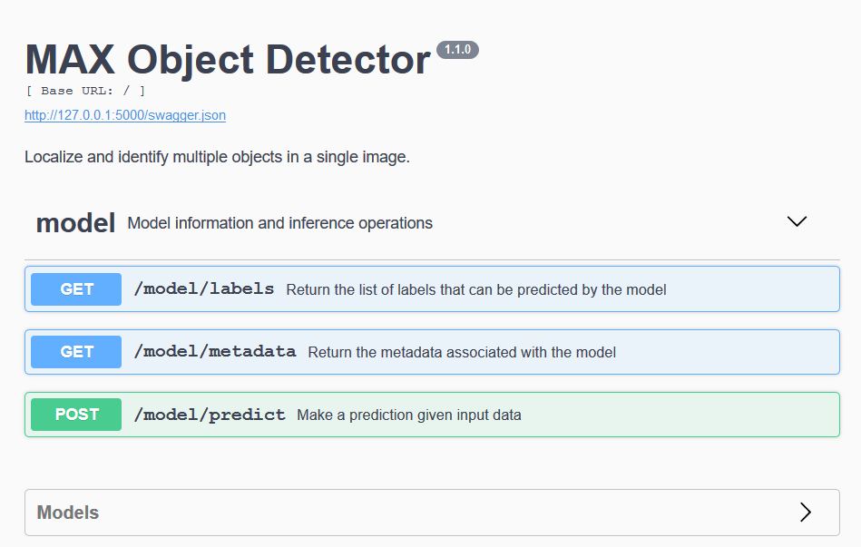
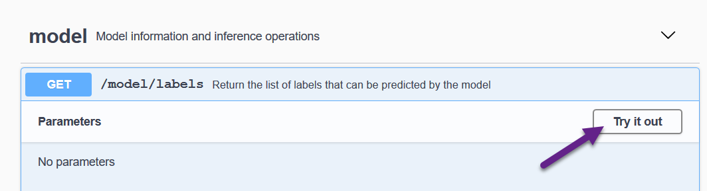
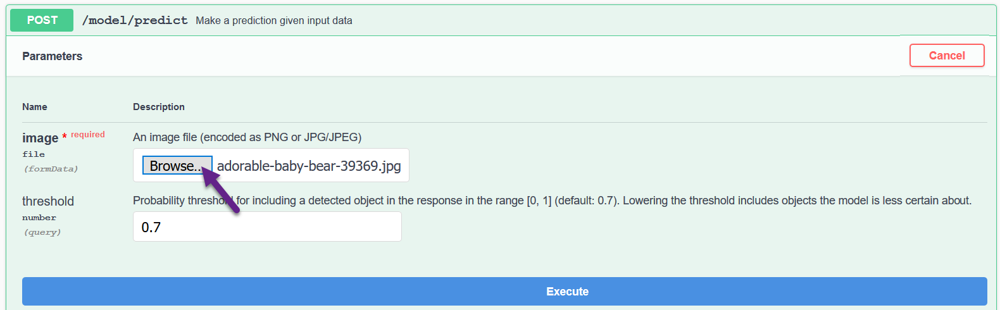
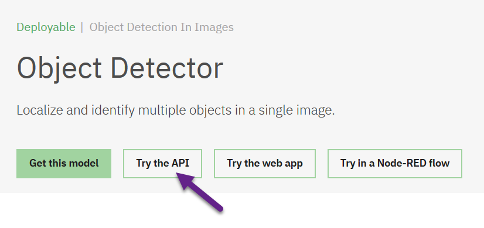

## Deep Learning microservices

Model-serving microservices from the Model Asset Exchange makes deep learning functionality available to your applications and services using a simple REST API, which you can access using the programming language (or utility) of your choice.

#### Explore available deep learning models
 
1. Open https://developer.ibm.com/exchanges/models/ in your browser.
1. Review the deep learning model list.
1. Locate the [Object Detector](https://developer.ibm.com/exchanges/models/all/max-object-detector/) model.
1. Review the model information.

Next, you will run one of the model-serving microservices.

#### Run a model-serving microservice

You can run a model-serving microservice locally using Docker or in the cloud using Kubernetes. In this lab you will run the [Object Detection](https://developer.ibm.com/exchanges/models/all/max-object-detector/) microservice in your local environment.

1. Open a terminal window.
1. Download the ready-to-use Docker image from [Docker Hub](https://hub.docker.com/r/codait/max-object-detector) and run it.

   ```
   $ docker run -it -p 5000:5000 codait/max-object-detector
    ...
    Unable to find image 'codait/max-object-detector:latest' locally
    latest: Pulling from codait/max-object-detector
    ...
   ```
   
   > If the command fails with `Error response from daemon: driver failed programming external connectivity on endpoint` restart Docker.
   
 1. Open http://127.0.0.1:5000/ in your web browser to display the microservice's [OpenAPI Specification (OAS)](https://www.openapis.org/about). 
 
 1. Expand the *model* section to review the model-serving endpoints for this model:

    


    * `/model/labels`: Return the list of labels that can be predicted by the model. 
    * `/model/metadata`: Returns information about the model-serving microservice.
    * `/model/predict`: Applies the deep learning functionality on the provided input data.

   > Each model-serving microservice exposes the `/model/metadata` and `/model/predict` endpoints. Some model-serving microservices expose additional model-specific endpoints.
 
#### Explore the model-serving microservice endpoints

You can easily explore the REST endpoints using any HTTP client, such as your web browser or [`curl`](https://curl.haxx.se/).

##### Explore the `/model/labels` endpoint

1. In your web browser expand the **GET `/model/labels`** section.
1. Click **Try it out** and **Execute**.

   
1. Review the JSON response. It identifies the types of objects that this service can detect in an image:
   ```
    {
      "count": 80,
      "labels": [
        {
          "id": "1",
          "name": "person"
        },
        {
          "id": "2",
          "name": "bicycle"
        },
        {
          "id": "3",
          "name": "car"
      ...
     
   ```
 
 ##### Explore the `/model/predict` endpoint

1. In your web browser expand the **POST `/model/predict`** section.
1. Click **Try it out**.
1. Download a JPG or PNG picture, such as [this one](https://www.pexels.com/photo/wood-bridge-cute-sitting-39369/) and select it as input.
   

1. Review, but do not change, the _threshold_ parameter.
1. Click **Execute**.
1. Review the JSON response, which lists the detected objects (`label`), the confidence (`probability` - "higher is better"), and normalized object coordinates within the image (`detection_box`). In this example, the model is very certain that the image contains a  teddy bear (99.1% probability) and a person (98.9% probability).

   ```
    {
      "status": "ok",
      "predictions": [
        {
          "label_id": "88",
          "label": "teddy bear",
          "probability": 0.9914733171463013,
          "detection_box": [
            0.2768396735191345,
            0.5637906789779663,
            0.6414954662322998,
            0.8442893028259277
          ]
        },
        {
          "label_id": "1",
          "label": "person",
          "probability": 0.9888521432876587,
          "detection_box": [
            0.24495704472064972,
            0.2684459686279297,
            0.6581913828849792,
            0.5713999271392822
          ]
        }
      ]
    }
   ```
1. Assign a low value to the _threshold_ parameter (such as `0.3`) and click **Execute** to process the same image again.
1. Review the results. Additional objects might be listed in the JSON response.
   ```
    ...
    {
      "label_id": "15",
      "label": "bench",
      "probability": 0.4469583332538605,
      "detection_box": [
        0.5613135099411011,
        0,
        0.9731512069702148,
        0.9959666728973389
      ]
    }   
   ```
   
1. If you have `curl` installed run the following command in a terminal window, replacing `adorable-baby-bear-39369.jpg` with your image name. (You can also try this using your favorite HTTP client.) The response should be identical to the response that was returned earlier.
   ```
   $ curl -F "image=@adorable-baby-bear-39369.jpg" -XPOST http://127.0.0.1:5000/model/predict?threshold=0.3
   ```

#### Explore the model-serving microservice endpoints using hosted evaluation instances

You can explore and test a model-serving microservice without having to download and run a Docker image. 

1. On the [Object Detector model page](https://developer.ibm.com/exchanges/models/all/max-object-detector/) click **Try the API** to access a hosted evaluation instance of the selected model-serving microservice.

   

## Next steps

[Continue to module 2](/module_2/) or [return to the workshop home page](/).

## Resources

  - [Tutorial: Get started with the Model Asset Exchange](https://developer.ibm.com/tutorials/getting-started-with-the-ibm-code-model-asset-exchange/)
