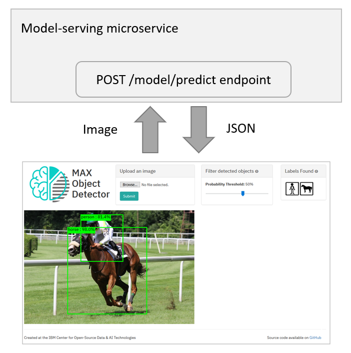

## Web application development

You can utilize the model-serving microservice using the standardized REST API. In this module you will customize a sample web application to consume the microservice you've deployed in the previous module. The sample web application is a simplified version of the [Object Detection application](https://developer.ibm.com/patterns/create-a-web-app-to-interact-with-objects-detected-using-machine-learning/).





Follow the instructions for your programming language of choice:
- [Node.js](#consuming-using-nodejs)
- [Python](#consuming-using-python)

---
### Consuming using Node.js

To complete this section, [Node.js](https://nodejs.org/en/) must be installed on your machine.

1. Clone the Node.js sample application repository https://github.com/IBM/max-tutorial-app-nodejs in a terminal window.

   ```
   $ git clone https://github.com/IBM/max-tutorial-app-nodejs
   $ cd max-tutorial-app-nodejs
   ```

    > If you’d like to review the finished sample application (instead of completing the following steps), check out the solution branch by running `git checkout solution` in the terminal window.

1. Open the `static/index.html`, `static/js/webapp.js`, and `app.js` files in your favorite editor.

    - `static/index.html` implements a simple web UI, providing users with the ability to select a PNG/JPG image from their local file system.
    - `static/js/webapp.js` contains JavaScript code that invokes the model microservice’s prediction endpoint `/model/predict`, parses the results, and draws annotated bounding boxes around detected objects.
    - `app.js` implements a simple Express-based web server that serves the static application content (web pages, JavaScript, stylesheets, and so on) and redirects requests to the model microservice.

1. In the `static/js/webapp.js` file:

    1. Locate `TODO R1` and review the prediction request payload. The model that you are using requires a PNG/JPG-encoded image file as input and accepts a threshold as optional input. The threshold acts as a filter, removing detected objects from the result set that the model is less certain about. In this sample application, we are overriding the default (0.7) for illustrative purposes with a lower value.
    1. Locate `TODO T1` and replace the `**TODO**` placeholder with your microservice’s prediction endpoint `/model/predict`.
       > Use `http://max-object-detector.max.us-south.containers.appdomain.cloud/model/predict` if you are not running the model-serving microservice locally. 
       
       > Remember you can review the endpoint specification by opening the microservice URL (for example, http://127.0.0.1:5000/). 
    1. Locate `TODO T2` and replace the `**TODO**` placeholder with your microservice’s prediction request method `POST`.

1. Save your changes.

1. Install the prerequisites and run the application.

   ```
   $ npm install
   $ npm start
   ```

1. Open http://localhost:8090/ in your web browser.

    - In Safari: Open the Network tab in the Web Inspector (MacOS: &lt;option>&lt;command>&lt;i>).
    - In Google Chrome: Open the Network tab in the Developer Tools (MacOS: &lt;option>&lt;command>&lt;i>).
    - In Mozilla Firefox: Open the Network tab in the Web Developer Tools (MacOS: &lt;option>&lt;command>&lt;i> Windows: &lt;Ctrl>&lt;Shift>&lt;I>).

1. Choose a sample image from the `assets`/ directory (or any other PNG/JPG image you might have stored on your machine), and click **Detect Objects**.

   If you’ve defined the endpoint URL and request method properly, a message appears indicating that no objects were detected. This is expected because you have not yet customized the code that processes the microservice response.

1. In your browser’s _Network_ tab, inspect the response of your prediction request. It should look similar to:

    ```
    {
        "status": "ok", 
        "predictions": [
            {
                "label_id": "19", 
                "label": "horse", 
                "probability": 0.9800629615783691, 
                "detection_box": [
                    0.15102773904800415, 
                    0.25595152378082275, 
                    0.9119446873664856, 
                    0.7204357981681824
                ]
            }, 
            {
                "label_id": "1", 
                "label": "person", 
                "probability": 0.8138303756713867, 
                "detection_box": [
                    0.039235919713974, 
                    0.3334605097770691, 
                    0.4493279755115509, 
                    0.5806631445884705
                ]
            }
        ]
    }
    ```

1. The `predictions` array contains an entry for each detected object, identifying:

    - The object `label` (for example, person, dog, or cat)
    - The confidence (`probability`) that the detected object represents the specified label (1 = high confidence, 0 = low confidence)
    - The normalized coordinates (y_1, x_1, y_2, x_2) of a rectangle that encloses the detected object
    
1. In the `static/js/webapp.js` file:

    - Locate `TODO T3` and replace the `**TODO**` placeholder with `predictions`.
    - Save your changes. 

1. Reload http://localhost:8090/ in your web browser and try to detect objects again.

    The application should display bounding boxes around detected objects along with the label.

    

Notes:

- For illustrative purposes this application contains code that parses the prediction response and manually annotates the input image using the returned labels and bounding boxes. In your own application you should take advantage of the [`max-vis`](https://github.com/CODAIT/max-vis) package, which provides convenience functions that manipulate the input image. Refer to the [examples](https://github.com/CODAIT/max-vis#examples) for more information.
- Cross-Origin Requests: The model-serving microservice blocks by default CORS requests. To enable CORS, launch the microservice and specify `CORS_ENABLE=true`:
  ```
  $ docker run -it -p 5000:5000 -e CORS_ENABLE=true codait/max-object-detector
  ```

---
### Consuming using Python

1. Clone the Python sample application repository https://github.com/IBM/max-tutorial-app-python in a terminal window.

   ```
   $ git clone https://github.com/IBM/max-tutorial-app-python
   $ cd max-tutorial-app-python
   ```

   > If you’d like to review the finished sample application (instead of completing the following steps), check out the solution branch by running `git checkout solution` in the terminal window.

1. Open the `app.py` file in your favorite editor.

   The application implements a simple Flask-based web server that serves the static application content (web pages, stylesheets, and so on) and invokes the model microservice’s prediction endpoint.

1. In the app.py file:

    1. Locate `TODO R1` and review the prediction request payload. The model that you are using requires a PNG/JPG-encoded image file as input and accepts a threshold as optional input. The threshold acts as a filter, removing detected objects from the result set that the model is less certain about. In this sample application, we are overriding the default (0.7) for illustrative purposes with a lower value.
    1. Locate `TODO T1` and replace the `**TODO**` placeholder with your microservice’s prediction endpoint `/model/predict`.
    > Use `http://max-object-detector.max.us-south.containers.appdomain.cloud/model/predict` if you are not running the model-serving microservice locally.
    
    1. Save your changes.

    > Remember you can review the endpoint specification by opening the microservice URL (for example, http://127.0.0.1:5000/). 

1. Install the prerequisites and launch the application in the terminal window.

   ```
   $ pip install -r requirements.txt
   $ python app.py
   ```

1. Open http://127.0.0.1:8090/ in your web browser.

1. Choose a sample image from the `assets/` directory (or any other PNG/JPG image that you might have stored on your machine) and click **Detect Objects**.

   > If you’ve defined the endpoint URL and request method properly, a message appears indicating that no objects were detected. This is expected because you have not yet customized the code that processes the microservice response.

1. Inspect the application’s debug output. It should look similar to this:

   ```
   {
       'predictions': [
           {
               'detection_box': [
                   0.15159347653388977,
                   0.2563893496990204,
                   0.9120281934738159,
                   0.7208174467086792
                ],
            'label': 'horse',
            'label_id': '19',
            'probability': 0.9795926213264465
            },
            {
                'detection_box': [
                    0.03912264108657837,
                    0.33404117822647095,
                    0.4486423134803772,
                    0.5761507153511047
                ],
                'label': 'person',
                'label_id': '1',
                'probability': 0.7997678518295288
            }],
        'status': 'ok'
    }
    ````

    The `predictions` array contains an entry for each detected object, identifying:

    - The object `label` (for example, person, dog, or cat)
    - The confidence (`probability`) that the detected object represents the specified label (1 = high confidence, 0 = low confidence)
    - The normalized coordinates (y_1, x_1, y_2, x_2) of a rectangle that encloses the detected object
    

1. In the `app.py` file:
    1. Locate `TODO T2`, uncomment the next line, and replace the `**TODO**` placeholder with `predictions`.
    1. Save your changes.

1. Reload http://127.0.0.1:8090/ in your web browser and try to detect objects again.

    The application should display bounding boxes around detected objects along with the label.
    
    


## Next steps

[Continue to module 3](/module_3/) or [return to the workshop home page](https://github.com/CODAIT/max-workshop-oscon-2019).

## Resources

  - [Code pattern: Create a web app to visually interact with objects detected using machine learning](https://developer.ibm.com/patterns/create-a-web-app-to-interact-with-objects-detected-using-machine-learning/) 
