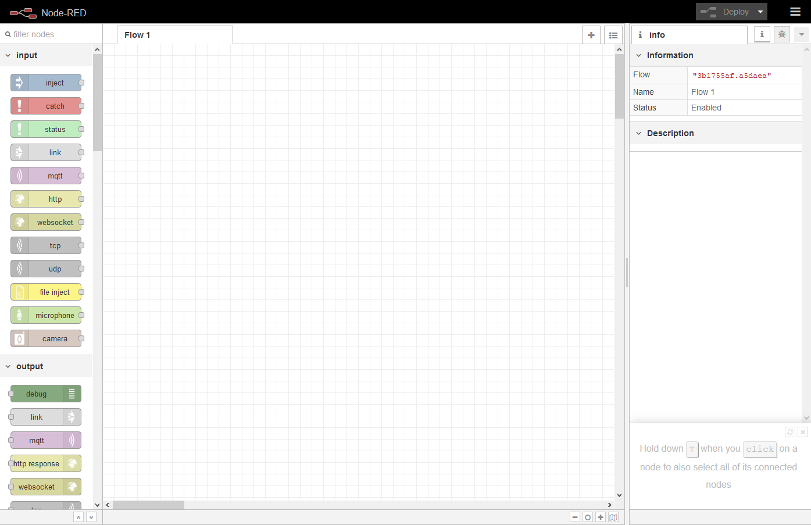
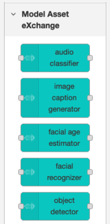
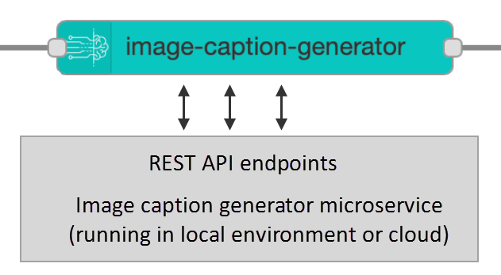
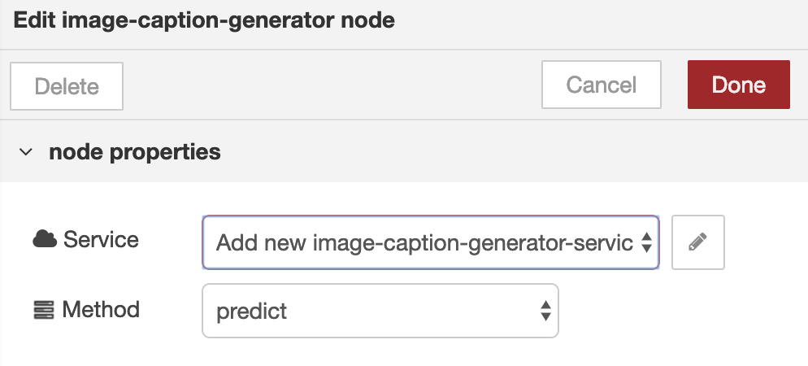
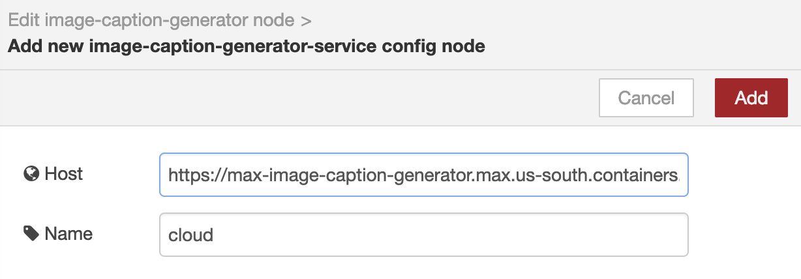
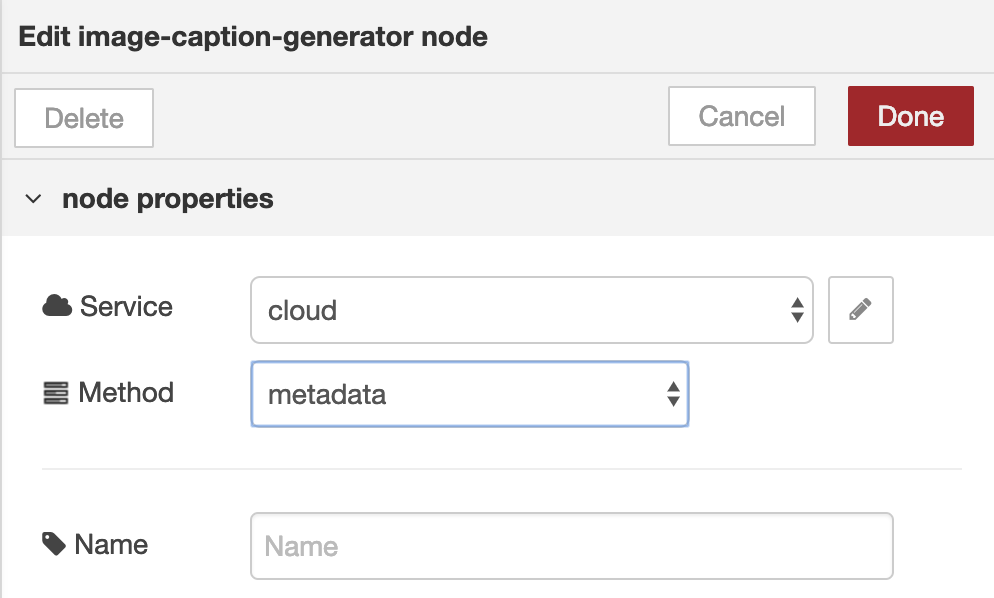
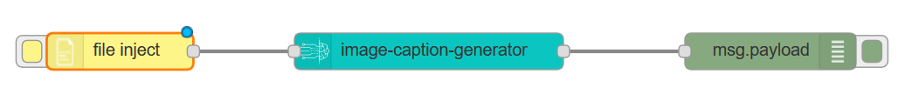
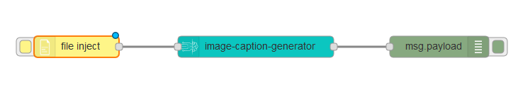
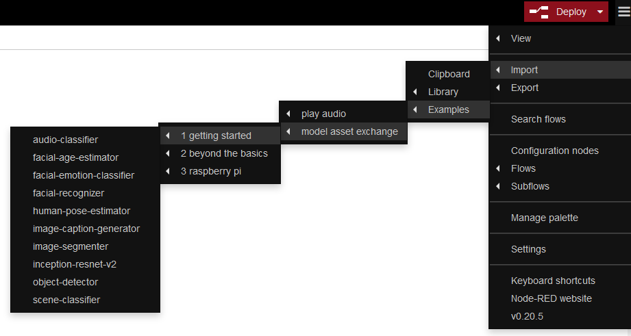

## Internet of Things

You can utilize the model-serving microservice in your applications to enrich or analyze data that was captured or generated by IOT devices. In this module you will use [Node-RED](https://nodered.org/), a programming tool for wiring together devices and APIs.

## Setup

You can complete this module using a sandbox Docker image or an existing local installation of Node-RED (and Node.js):

- [Use Node-RED in a sandbox](#Use-Node-RED-in-a-sandbox-(Docker-image))
- [Use a local Node-RED installation](#use-a-local-Node-RED-installation)

---
### Use Node-RED in a sandbox (Docker image)

If you don't have Node-RED installed on your machine you can use the [`codait/max-node-red-demo`]() sandbox image.

1. Launch the Docker image, which has all prerequisites pre-installed.

   ```
   $ docker run -p 5555:1880 codait/max-node-red-demo
   ```

1. Open http://127.0.0.1:5555/ in your web browser to access the Node-RED editor.

   

   In this sandbox [Node.js](https://nodejs.org/en/), [Node-RED](https://nodered.org/) and the [`node-red-contrib-model-asset-exchange` module](https://www.npmjs.com/package/node-red-contrib-model-asset-exchange) have been pre-installed and are ready to use.

   > Note. When you stop the Docker image all changes you've made using the editor are discarded.
 

[Continue to the instructions](#generate-an-image-caption).

---
### Use a local Node-RED installation

This module has been tested using Node.js version 10.13 and Node-RED version 0.19.5.

1. Start your existing Node-RED.

1. Open the Node-RED editor in your web browser. The default port is http://127.0.0.1:1880/. 

##### Import the Model Asset Exchange nodes

The Model Asset Exchange nodes are published on [npm](https://www.npmjs.com/package/node-red-contrib-model-asset-exchange).

1. From the **&#9776;** menu, select **Manage palette**.
1. In the _Palette_ tab of the _User Settings_, select **Install**.
1. Search for the [`node-red-contrib-model-asset-exchange`](https://flows.nodered.org/node/node-red-contrib-model-asset-exchange) module and install it.
1. Search for the [`node-red-contrib-browser-utils`](https://flows.nodered.org/node/node-red-contrib-browser-utils) module and install it.
1. Close the settings window.

[Continue to the instructions](#generate-an-image-caption).

---
## Generate an image caption

Assume you want to create an application that annotates images with a caption, describing what the image depicts.

1. Explore the palette on the left hand side. Several nodes should be displayed in the _Model Asset eXchange_ category.

   

   Each Model Asset Exchange node uses the endpoints of a model-serving microservice that you can run in a local environment or in the cloud.

   

To keep this module simple, you'll associate your nodes with hosted demo microservice instances. 

For illustrative purposes, you'll be using the image caption generator node, which analyzes an image and generates a caption. If you prefer, you can follow along using a different node. The steps and concepts covered in this module apply to all nodes.

1. Drag the **image caption generator** node onto the workspace and review the displayed information. The node has one input and one output (the microservice response).

1. Double-click the node to edit it. Two node properties are listed: _service_ and _method_.

   

1. Edit the _service_ node property to associate the node with an instance of the image caption generator microservice.

1. By default, _host_ is pre-populated with the URL of a hosted demo instance of this microservice, which you can use to explore its capabilities. Click **Add** to associate this demo instance with your node.

   

    > Never use hosted demo microservice instances for production workloads. To use your own (local or cloud) microservice instance, enter its URL (for example, `http://127.0.0.1:5000` if you are running the service on your local machine using the pre-built Docker container from Docker Hub).

1. The Model Asset Exchange microservices expose multiple endpoints, which are listed under the _method_ property. By default, the _predict_ method is selected, which analyzes the node's input. From the drop-down list, select **metadata** to retrieve information about the microservice.

   

   > Some methods accept optional parameters, such as a threshold value. (There are none for the image caption generator.)

1. Close the node's properties window.

1. Drag an **inject** _input_ node onto the workspace and connect its output to the input of the image _caption generator_ node.

   > The node name automatically changes to _timestamp_. (We are only using this node to run the flow. The _metadata_ method of the microservices does not require any input.)

1. Drag a **debug** output node onto the workspace and connect its input to the output of the _image caption generator_ node.

   Your completed flow should look like the following image.

   

1. Deploy the flow.

1. From the **&#9776;** menu, select **View** > **Debug messages** to open the debug output view.

1. Click the _inject_ node's button to inject a message into the flow and inspect the debug output. If your setup is correct, the output should look like:

   ```
    {
        "id":"max-image-caption-generator",
        "name":"MAX Image Caption Generator",
        "description":"im2txt TensorFlow model trained on MSCOCO",
        "type":"Image-to-Text Translation",
        "source":"https://developer.ibm.com/exchanges/models/all/max-image-caption-generator/",
        "license":"Apache 2.0"
    }
   ```

You've just confirmed that the node can connect to the specified service. Next, you'll modify the flow to generate an image caption.

### Generate an image caption

The image caption generator's `predict` method analyzes the provided input image and generates a brief description of the image's content.

1. Double-click the _image caption generator_ node to edit its properties.
1. Change the selected _method_ from _metadata_ to **predict**.
1. Replace the _inject_ node with the **file inject** node (or the **camera** node - only supported in Chrome or Firefox) and connect its output to the _image caption generator_ node.

    

1. Deploy the flow.
1. Click the **file inject** (or **camera**) node's button to select an image (or take a picture) and inspect the debug output, which should contain a caption describing the image.

    ```
    a man sitting on a bench with a dog .
    ```

   You can access the entire microservice JSON response through the message object.

1. Open the _debug_ node's properties and change the output to **complete msg object**.
1. Redeploy the flow and rerun it.
1. Inspect the output. The message `details` contain a `predictions` array that contains generated captions.

    ```
    {
        "payload":"a man sitting on a bench with a dog .",
        "_msgid":"e413ccf9.6be56",
        "statusCode":200,
        "details":{
            "status":"ok",
            "predictions":[
                {
                    "index":"0",
                    "caption":"a man sitting on a bench with a dog .",
                    "probability":0.00033008667895732374
                },
                {
                    "index":"1","
                    caption":"a teddy bear sitting on a bench in a park .",
                    "probability":0.0003164804234766239
                },
                {
                    "index":"2",
                    "caption":"a teddy bear sitting on a bench in a park",
                    "probability":0.00009952797258182693
                }
            ]
        },
        "topic":"max-image-caption-generator"
    }
    ```

## Explore other model nodes

The `node-red-contrib-model-asset-exchange` module includes a couple getting started flows that you can import into your workspace.

1. From the **&#9776;** menu, select **Import** > **Examples** > **model asset exchange**.

    

1. Select one of the flows to import it into your workspace.
1. Review the pre-configured flow, deploy, and run it.


## Next steps

[Return to the workshop home page](/).

## Resources

  - [Tutotrial: Leverage deep learning in your Node-RED flows](https://developer.ibm.com/tutorials/learn-how-to-leverage-deep-learning-in-your-node-red-flows/) 